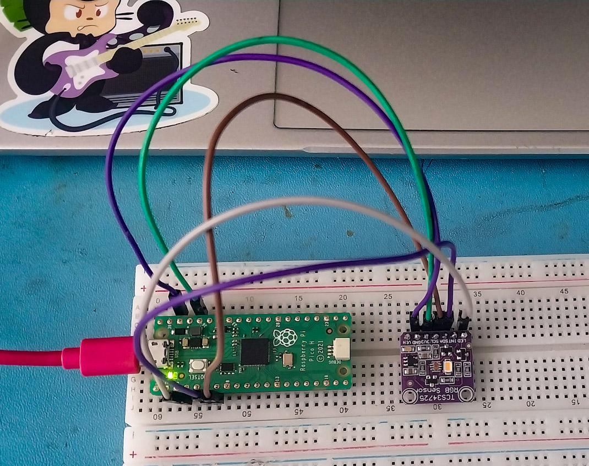

# TCS34725-Module-MicroPython-Code
This is a light weight Micropython for identifying the color of an LED (or any light source) using the **TCS34725** RGB color sensor. Designed for Raspberry Pi Pico, communicating over I2C.
The script reads Clear/Red/Green/Blue values from the sensor, converts them to HSV, and classifies the detected light into one of the several standard colors as per the Onboard LED programming(Red, Yellow, Green, Cyan, Blue, Magenta, White, or 
Off/Dark).

## Features
- Direct I2C register access - no external sensor library required.
- HSV-based color classification (more robust than raw RGB thresholding).
- Configuration gain and intergration time.
- Continuous scanning loop with clean 'Ctrl+C' exit.
- Prints live RGB channle ratios for debugging/calibration

## Hardware
- A microcontroller running Micropyhton (tested with Raspberry Pi Pico)
- Adafruit TCS34725 (Or compatible) color sensor breakout

### Wiring



|   Board           | I2C Bus | SDA | SCL | LED | 3.3V | GND |
| Raspberry Pi Pico |   0     | GP4 | GP5 | GP2 | 3.3V | GND |
Update the wiring assignments in the script if your wiring differs.

## Installation
1. Flash Micropython onto your board if you haven't already
2. Copy `TCS34725_Module.py` onto the board. (e.g. via `mpremote` or Thonny IDE)
3. Wire the TCS34725 sensor to the pins listed above
4. Run the script:
   ```bash
    mpremote run color_scanner.py
    ```
  or open it in Thonny and press Run

## Usage 
Once running, the script continuously prints the detected color and channel ratiors:
```
Initializing TCS34725 sensor...
Scanner running. Press Ctrl+C to stop.

Detected: RED
Ratio -> R: 68% | G: 18% | B: 14% | C: 812
--------------------------------------------------
Detected: BLUE
Ratio -> R: 12% | G: 20% | B: 68% | C: 745
--------------------------------------------------
```

Press `Ctrl+C` to stop the scanner cleanly.

### Configuration
You can tune sensitivity and accuracy by editing these constants near the top of the script:
- **Intergration time** (`REG_ATIME` IN `init_sensor()`): controls how long the sensor samples light. Lower values = faster but noisier readings; higher vlaues = slower but precise.
-  **Gain** (`REG_CONTROL` in `init_sensor()`): amplifies weak signals. Increase for dim environments, decrease if readings are sauturating.
-  **Dark threshold** (`clear < 150` in `identity_led_color()`): the minimum clear-channel value before a reading is considered "off."
-  **Saturation threshold** (`s < 25` in `identity_led_color()`): controls how strictly the white classifcation is.
-  **Hue Windows**: adjust the ranges in the `identity_led_color()` to better match your specific LEDs, since the real-world hues can drift from textbook RGB values.

## How it Works
1. `init_sensor()` powers the TCS34725 and configures gain/intergration time over I2C.
2. On each loop iteration, `read_reg_words()` pulls the raw Clear, Red, Green, and Blue 16 bit values.
3. `calculate_hsv()` converts RGB into Hue and Saturation, which are more reliable for classing colors under varying brightness.
4. `identify_led_color()` maps the Hue/Saturation values to a human-readable color label

## License
MIT - Feel free to use, modify, and share.
